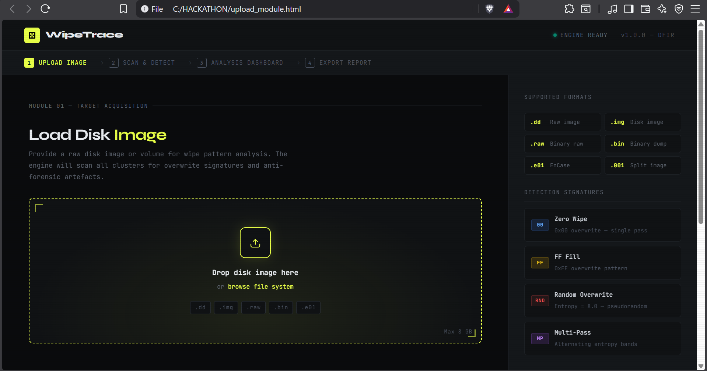
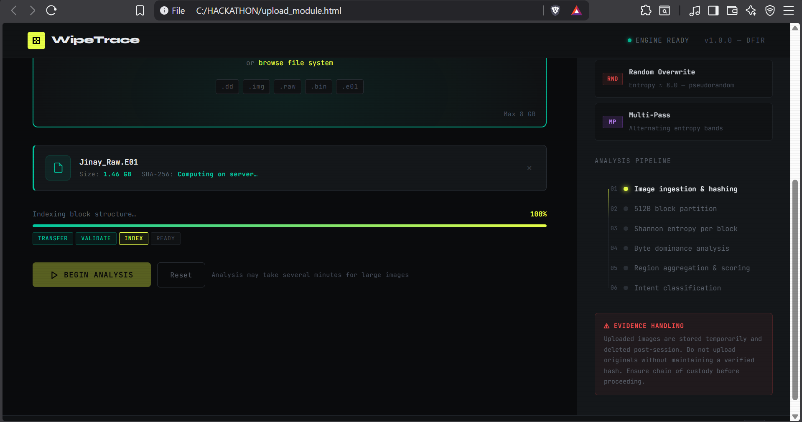
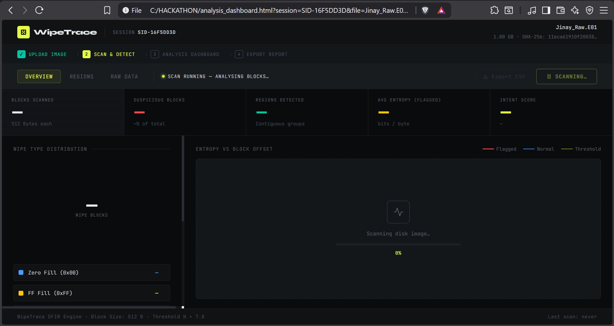
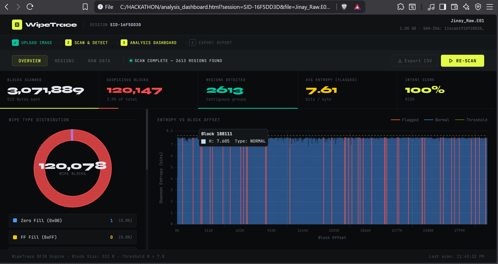
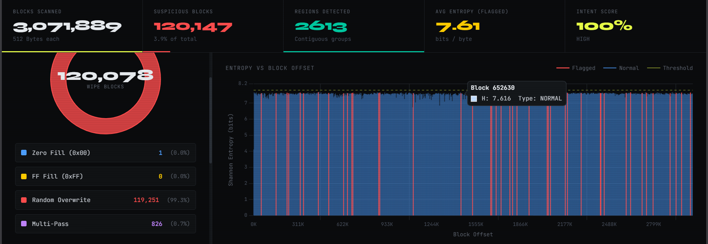
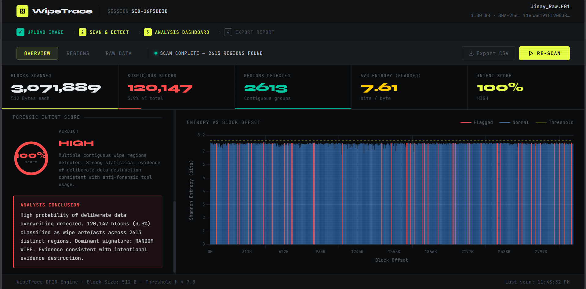
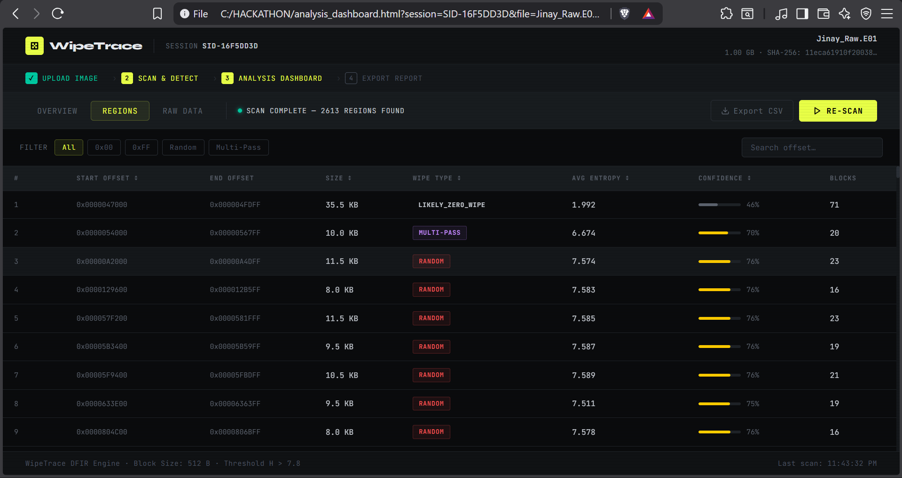

# ISEA Hackathon — Anti-Forensic Data Wiping Detection Engine

A high-performance disk image analysis engine designed to detect intentional data wiping patterns inside forensic images.

Built during a 24-hour ISEA Anti-Forensic Detection Hackathon.

We did not win the competition.  
We did build a robust, modular, working detection system.

---

## Problem Statement

When an attacker anticipates forensic acquisition (raids, internal investigations, incident response), they may attempt to destroy evidence using:

- Zero-fill wipes (`0x00`)
- FF-fill wipes (`0xFF`)
- Random overwrite
- Multi-pass overwrite strategies
- Low-and-slow wiping to evade threshold detection

Traditional forensic tools can detect absence of data — but often do not clearly quantify wipe intent or differentiate noise from deliberate destruction.

This project focuses on:

> Detecting structured, intentional wipe behavior inside raw disk images.

---

## System Architecture

```
project/
├── upload_module.html
├── analysis_dashboard.html
├── hashing.py
├── backend_main.py
├── scanner.py
│
├── engine/
│ ├── reader.py
│ ├── classifier.py
│ ├── aggregator.py
│ ├── scorer.py
│ └── writer.py
│
└── uploads/
└── analysis_<SID>.json
```
---

## Architecture Overview

### 1️ Reader (`engine/reader.py`)

- Streams raw disk images in 4KB blocks
- Memory-efficient
- Designed for large forensic images
- No full image loading into RAM

---

### 2️ Block Classifier (`engine/classifier.py`)

Per-block classification into:

- `ZERO` → all `0x00`
- `FF` → all `0xFF`
- `RANDOM` → high entropy overwrite
- `MULTI` → mixed structured overwrite patterns
- `NORMAL` → non-wipe content

Designed for deterministic behavior — no ML guesswork.

---

### 3️ Aggregator (`engine/aggregator.py`)

- Merges consecutive flagged blocks
- Converts block-level noise into region-level intelligence
- Eliminates fragmented false positives

---

### 4️ Intent Scorer (`engine/scorer.py`)

Core logic layer.

Calculates:

- Intent score
- Region confidence
- False-positive filtering
- Pattern coherence weighting

**Focus:**  
Distinguishing legitimate high-entropy content from deliberate wipe patterns.

---

### 5️ Writer (`engine/writer.py`)

- Outputs structured JSON
- Stored as:
  uploads/analysis_<SID>.json


- Designed for dashboard consumption
- API-consumable output format

---

## Backend

### `backend_main.py`

- Handles file upload
- Generates secure session ID
- Triggers hashing + scan pipeline
- Serves analysis output

### `hashing.py`

- Calculates cryptographic hashes
- Ensures evidence integrity tracking
- Prepares image fingerprint before analysis

---

## Dashboard

### `analysis_dashboard.html`

- Visualizes detected wipe regions
- Displays intent score
- Shows region offsets and classifications
- Designed for clarity over aesthetics

---

## Detection Philosophy

We avoided:

- Kernel drivers
- Memory forensics
- Unrealistic threat assumptions
- Overuse of entropy as a magic metric

We focused on:

- Host-acquired disk images
- Block-level deterministic classification
- Region-based reasoning
- Practical forensic signals

This is not a ransomware detector.  
This is not a full DFIR suite.

This is a specialized anti-forensic wipe detection engine.

---

## What It Detects

- Structured wipe attempts
- Multi-pass overwrites
- Large contiguous random regions
- Suspicious block homogeneity
- Coherent wipe segments inconsistent with normal file system behavior

---

## What It Does Not Do

- File carving
- File system reconstruction
- Attribution
- Network forensics
- Real-time monitoring

This is post-acquisition forensic analysis.

---

## Technical Design Principles

- Streaming architecture
- Modular engine separation
- Deterministic logic
- False-positive minimization
- JSON-first output design
- Scalable to large disk images

---

## Dependencies

This project is built using Python 3.10+.

Required Packages

Install manually using:

```
pip install fastapi uvicorn python-multipart
```

### Core Dependencies Explained

FastAPI – Backend API framework

Uvicorn – ASGI server used to run the backend

python-multipart – Handles file uploads

hashlib (built-in) – File hashing

os / json (built-in) – File system + output handling

No external forensic or entropy libraries were used.
All detection logic is custom-built.

---

## How to Run the Tool (Local Setup)

### Step 1 — Start Backend Server

From the project root directory, run:
```
uvicorn backend_integrate:app --host 0.0.0.0 --port 8000
```
The server will start locally on:
```
http://localhost:8000
```
### Step 2 — Open the Upload Interface

Open the file:
```
upload_module.html
```
in your browser.

From there:

1. Upload a disk image

2. The backend hashes the file

3. The scanning engine executes

4. Results are written to:
```
uploads/analysis_<SID>.json
```

5. Dashboard consumes and visualizes output

That’s it.

---

## Screenshots

### 1️ Upload Interface




Upload disk image (.dd, .img, .raw, .bin, .e01) and initiate hashing + indexing pipeline.

---

### 2️ Scan in Progress



Real-time block-level scanning with entropy computation and wipe classification.

---

### 3️ Overview Dashboard





High-level metrics:
- Total blocks scanned
- Suspicious blocks
- Regions detected
- Average entropy
- Intent score

---

### 4️ Region-Level Analysis



Contiguous wipe regions with:
- Start offset
- End offset
- Block count
- Wipe type
- Confidence score

---

### 5️ Raw Block / Hex Analysis


Block-level entropy view with byte frequency visualization and multi-pass pattern detection.

---
## Hackathon Context

Built in 24 hours during the ISEA Anti-Forensic Detection Tool Building Hackathon.

**Constraints:**

- Limited time
- No external forensic libraries, frameworks or tools
- Pure custom detection logic

**Result:**  
A working prototype capable of detecting wipe behavior with region-level granularity.

---

## Future Improvements

- Smarter entropy variance modeling
- File system-aware wipe anomaly detection
- Temporal wipe pattern inference
- Visualization enhancements
- Report export (PDF / forensic-ready format)
- Automated false-positive benchmarking suite

---

## Use Cases

- Post-raid forensic review
- Corporate insider investigations
- Incident response validation
- Academic research in anti-forensic detection
- Cyber forensic training environments

---

## License

MIT License

---

## Final Note

This project was built under time pressure.

It is not a polished product.  
It is a serious prototype.

The goal was not to build hype.  
The goal was to understand and detect anti-forensic intent.

And that is exactly what this system attempts to do.
